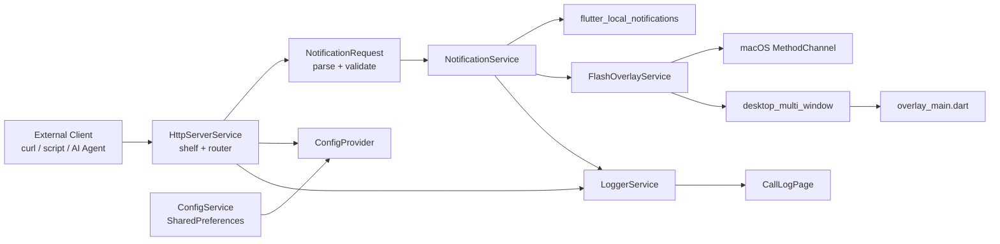
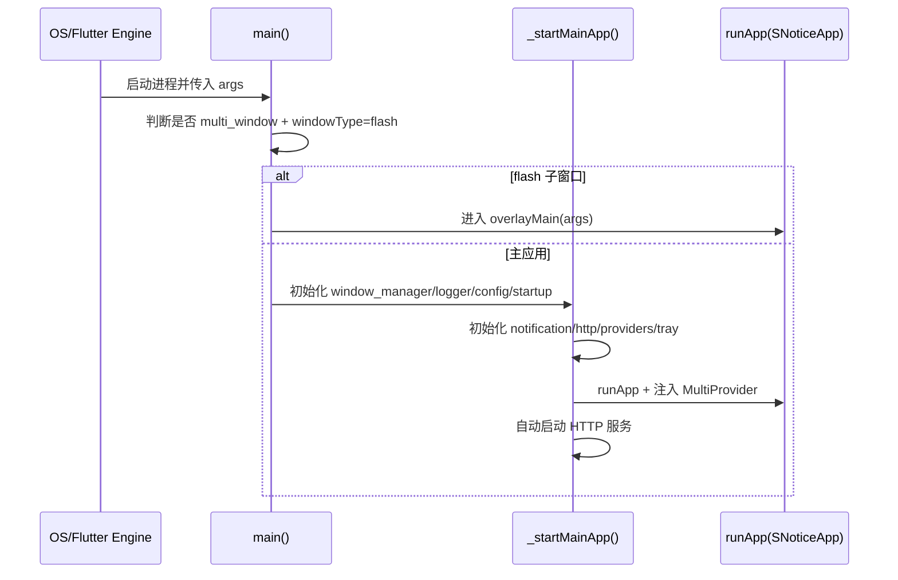

# SNotice 架构总览

> 文档快照：2026-03-15（基于当前代码仓库）

## 1. 项目定位

SNotice 是一个桌面端常驻应用（Flutter），提供本地 HTTP Webhook 能力，将外部请求转换为：

- 系统通知（macOS/Linux）
- 全屏闪烁/边缘闪烁覆盖层
- 弹幕覆盖层（barrage）
- MCP（JSON-RPC）工具调用入口

默认监听端口：`8642`。

---

## 2. 顶层架构

核心分层：

- `lib/services/`：服务编排与平台能力（HTTP、通知、托盘、启动项、覆盖层）。
- `lib/models/`：配置与请求模型（含校验和序列化）。
- `lib/providers/`：运行时状态（配置、服务状态、主题、语言）。
- `lib/ui/`：桌面壳层与业务页面。
- `lib/theme/` + `lib/l10n/`：主题系统与国际化资源。

---

## 3. 启动与依赖装配

入口文件是双入口模式：

- 主入口：`lib/main.dart`
- 覆盖层入口：`lib/overlay_main.dart`

启动流程：

`_startMainApp()` 中的关键依赖顺序：

1. `ConfigService` 读取持久化配置。
2. `StartupService` 同步开机自启状态。
3. `NotificationService` 初始化本地通知插件。
4. `HttpServerService` 用当前配置启动 HTTP 监听。
5. `TrayService` 绑定 UI 显示、服务启动、退出动作。
6. `MultiProvider` 注入全局状态与服务。

---

## 4. HTTP 与 MCP 子系统

实现位置：`lib/services/http_server_service.dart`

### 4.1 对外接口

- `POST /api/notify`：发送通知/覆盖层
- `GET /api/status`：服务状态
- `POST /api/mcp`：MCP JSON-RPC 入口

### 4.2 中间件策略

- CORS：允许 `GET, POST, OPTIONS`
- IP 白名单：基于 `AppConfig.allowedIPs`（支持精确 IP + CIDR）

### 4.3 `notify` 请求链路

1. JSON 解析与对象校验。
2. `NotificationRequest.fromJson()` 反序列化。
3. `validate()` 规则检查。
4. 若 `category=barrage` 且未传细节参数，应用 `AppConfig.defaultBarrage*` 默认值。
5. 调用 `NotificationService.showNotification()`。

### 4.4 MCP 工具

当前 MCP 工具集合：

- `snotice_send_notification`
- `snotice_get_status`
- `snotice_get_config`

说明：MCP 与 REST 共用相同服务层能力，减少重复逻辑。

---

## 5. 通知与覆盖层执行模型

实现位置：

- `lib/services/notification_service.dart`
- `lib/services/flash_overlay_service.dart`
- `lib/overlay_main.dart`

分发策略：

- 普通通知：走 `flutter_local_notifications`
- `flash_full` / `flash_edge`：走覆盖层
- `barrage`：走覆盖层（可配置速度、轨道、字号、重复数）

平台差异：

- macOS：优先走 `MethodChannel('snotice/flash')` 触发原生能力。
- Linux/Windows：通过 `desktop_multi_window` 创建子窗口，进入 `overlay_main.dart` 执行动画。

---

## 6. 配置与状态管理

### 6.1 配置模型

`AppConfig`（`lib/models/app_config.dart`）包含：

- 服务端口、IP 白名单
- 开机自启
- 通知开关、弹幕开关
- 弹幕默认参数（颜色/时长/速度/字号/轨道/重复）

### 6.2 持久化

- `ConfigService` 通过 `SharedPreferences` 存取 `app_config` JSON。
- 主题、语言分别由 `ThemeProvider` / `LocaleProvider` 持久化。

### 6.3 运行态状态

- `ConfigProvider`：当前配置快照。
- `ServerProvider`：服务启停、端口切换重启、错误态。
- `LoggerService`：内存日志（默认最多 1000 条）并通知 UI。

---

## 7. UI 壳层结构

核心页面容器：`lib/ui/screens/app_shell.dart`

三栏签（IndexedStack）：

1. `CallLogPage`：日志过滤/暂停/清空
2. `HttpApiPage`：API 文档与示例
3. `HomeScreen`：服务状态与系统设置

特点：

- 左侧固定导航 + 右侧内容区（桌面优先布局）
- 设置页按卡片拆分（服务、IP、通知、主题、语言）
- 国际化文案统一来自 `AppLocalizations`

---

## 8. 平台集成点

- 托盘：`TrayService`（多语言菜单，服务状态联动）
- 开机自启：`StartupService`
  - macOS：原生 MethodChannel
  - Linux/Windows：`launch_at_startup`
- 窗口管理：`window_manager`
- 多窗口：`desktop_multi_window`

---

## 9. 测试现状

当前测试覆盖集中于单元与组件级：

- `test/http_server_service_test.dart`：`notify` / `mcp` 关键路径
- `test/notification_request_test.dart`：请求模型解析与校验
- `test/ip_utils_test.dart`：IP/CIDR 与配置白名单
- `test/logger_service_test.dart`：日志轮转与监听通知
- `test/http_api_page_test.dart`、`test/theme_settings_card_test.dart`：本地化 UI 校验

尚未覆盖：

- 真实平台通知行为（集成测试）
- 托盘和多窗口的端到端回归

---

## 10. 当前架构优点与注意点

优点：

- 服务层职责清晰，HTTP/MCP 共用核心能力。
- 双入口模型解耦主应用与覆盖层渲染。
- 配置模型与请求模型均具备边界校验。

注意点：

- `showNotifications` 配置目前未在 `NotificationService` 主流程中显式拦截，需要统一策略。
- 覆盖层能力依赖平台插件，跨平台行为建议持续做手工回归。
